# 自己动手编译OpenJDK1.8

## 前言

相信看过《深入理解Java虚拟机》的小伙伴都尝试过自己动手编译OpenJDK，有没有成功呢？评论告诉我。纵观网上那么多教程，不客气的说，要么讲的太简单要么不能用，今天，在踩了无数坑之后成功编译完成的我，为了不让后来者继续踩坑，所以决定写这篇博文。废话不多说，亮图：


## 想想自己到底在哪个坑🙈

我把编译JDK的坑分为这几个阶段

- 安装linux，配置环境工具如yum、ssh
- 下载OpenJDK，获取完整OpenJDK资源（解压后500M左右）
- 准备编译所需工具
- 编译中遇到的问题

小伙伴们可以对号入座，是第一步选错linux就绝了前路呢，还是下载OpenJDK执行bash ./configure 就是执行不了呢（OpenJDk不完整）？还是总是提示没有编译工具报错呢？或者最后倒在编译过程中呢？

总之，自己编译JDK的道路很是崎岖，哥们儿把走得通的路今天给大家讲个明明白白。

# 基础

### 1.linux 环境

目前主流是在linux下编译，这里使用CentOS-7-x86_64-Everything-2003.iso版本，链接:[Centos7下载](http://mirrors.aliyun.com/centos/7/isos/x86_64/CentOS-7-x86_64-Everything-2003.torrent)

不要使用其他任何版本的linux 包括CentOS8，都是血的教训，杠精可以试试，下文同理。

### 2.OpenJDK8源码下载

网站随便找篇博文，都会告诉你去官网下载： http://jdk.java.net/java-se-ri/8 ，but这个地址已经没了，现在Oracle已经不提供完全版源码的压缩包了，可以用的地址在http://hg.openjdk.java.net/，到了这个网站又是抓瞎，怎么用呢？以jdk8为例：

​		点击jdk8->再点击下个页面的jdk8->再点击左边的browse->再点击左边的zip

这样下载下来的就是一部分了，下载下来的文件夹放到linux下执行get_source.sh获取全部资源。这里有个坑，家里没有梯子的朋友，就算能执行get_source.sh也得下个十几个小时。🙃

想要完整版OpenJDK8的可以在：

- 我的github仓库下载，[下载地址](https://github.com/ChengYongchao/OpenJdk8)
- 百度云：https://pan.baidu.com/s/1dEyJr74kEO7Yyv_X-Jxiyw 提取码：0011

这个版本是能直接执行configure的,不需要执行get_source.sh。这里要是听不懂configure没关系，接着往下看。

### 3.JDK7

编译JDK8需要一个低一版本的JDK作为boot-jdk，所以需要准备一个 [jdk-7-linux-x64.tar.gz](http://download.oracle.com/otn-pub/java/jdk/7/jdk-7-linux-x64.tar.gz) ，[下载地址](https://www.oracle.com/cn/database/technology/java-se-jdk-7-download.html)

# 开始

### 1. 安装CentOS7

- 内存调整大一些，推荐8G，处理器8核
- 有需要远程连接的，[参考](https://www.cnblogs.com/mzhaox/p/11304793.html)
- 安装wget: yum install wget
- 修改yum源为阿里源：
	
	- cd  /etc/yum.repos.d/ 
	-  wget -O /etc/yum.repos.d/CentOS-Base.repo http://mirrors.aliyun.com/repo/Centos-7.repo 
	-  yum makecache 
- 安装解压工具


当然也可以直接执行 yum install zip unzip

### 2.上传JDK7

- 根目录创建文件夹java
- 上传JDK7到java文件夹下
- 解压：tar zxvf jdk-7u80-linux-x64.tar.gz


- 注意，不需要更改环境变量，只需要记住这个地址就行了：/java/jdk1.7.0_80/

### 3.处理源码包

- 切换到root用户:su root
- 根目录下创建javaTest文件夹:mkdir javaTest
- 上传源码包到javaTest文件夹下
- 解压：unzip YourOpenJDK.zip -d /javaTest/


- 进入解压后的文件夹中： cd YourOpenJDK


到此为止，前期准备工作都已做完，下面只需要不断执行 bash ./configure +参数 进行试错 排除自己少了哪些工具就行了。

### 4.执行bash ./configure +参数

```java
#命令
bash ./configure --with-target-bits=64 --with-boot-jdk=/java/jdk1.7.0_80/ --with-debug-level=slowdebug
#参数详解
--with-boot-jdk 就是前面说的bootjdk 地址改为自己解压jdk后的文件夹位置
--with-debug-level debug级别，这里写slowdebug方便排查问题
```

到这里，只需要切换到YourOpenJDK这个目录下，不断执行bash ./configure --with-target-bits=64 --with-boot-jdk=/java/jdk1.7.0_80/ --with-debug-level=slowdebug就行了

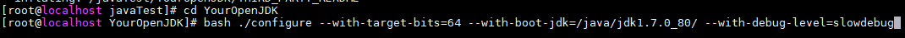

执行一次后看下报错提示，根据提示试用yum安装对应工具直到所有报错解决。举例：

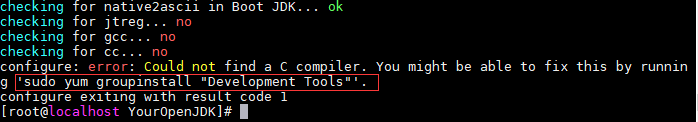


第一次执行时提示缺少开发工具，按照提示执行：

```java
sudo yum groupinstall "Development Tools"
```

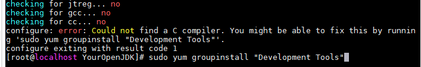

安装完毕后再次执行bash ./configure --with-target-bits=64 --with-boot-jdk=/java/jdk1.7.0_80/ --with-debug-level=slowdebug 下文同理，这里把遇到的一一列举：

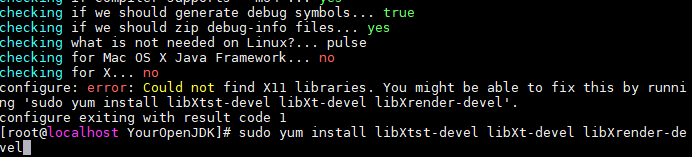

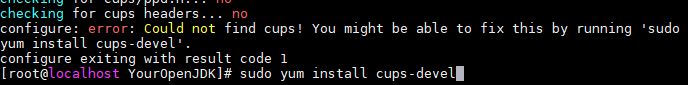

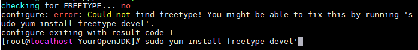

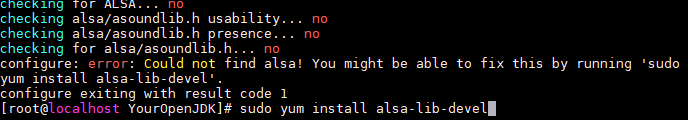

上述一共需要安装六个工具，一直到遇到下图，证明所有工具都准备完成：

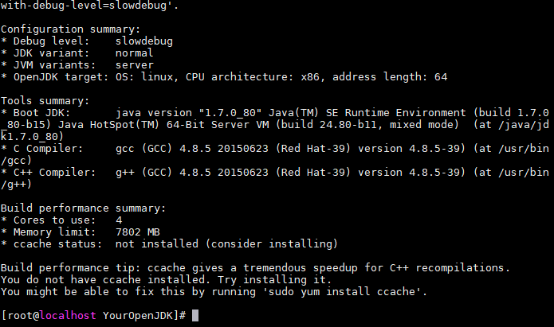

### 5.执行make all

执行

```java
make all
```


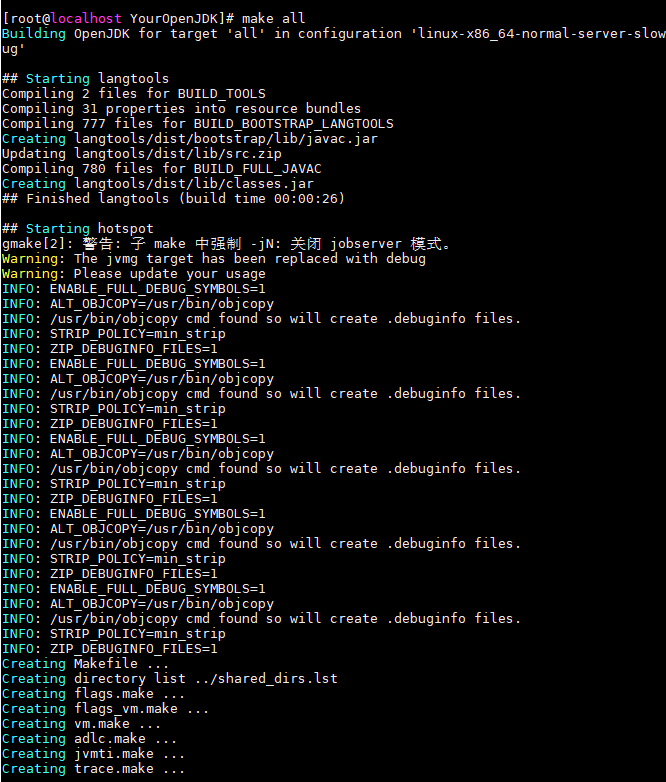

下面就是静静的等待，不会再遇到什么问题（按照上文做，没有的话不保证），根据机器的配置耗时从5min到30min不等，中间会有一些 WARNING警告 和下图的ERROR，都不用管.

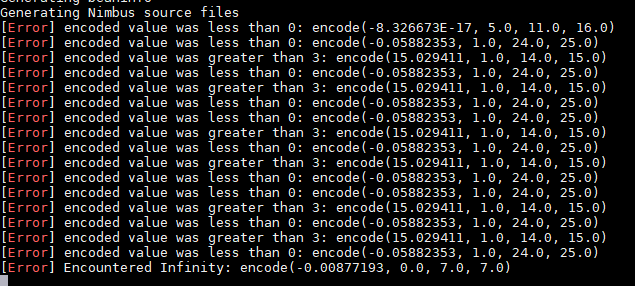

一直到结束，显示如下图：

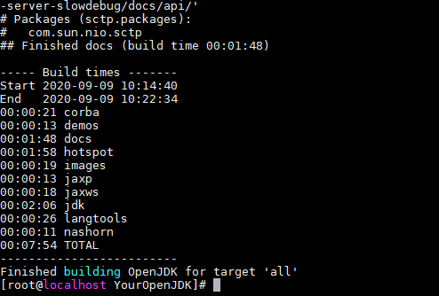

Congratulations~,踏过所有的坑，终于编译成功了。下面可以执行命令查看javaversion：

```java
cd build/linux-x86_64-normal-server-slowdebug/images/j2sdk-image/bin/

./java -version
```

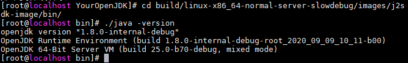

# 结尾

到这里，整个编译OpenJDK8的所有步骤都完成了，有哥们儿就说了，感觉很简单，建议没吃过亏的换个linux换个OpenJDK自己来一遍🙃

为了这几天掉的头发，觉得写的有用的哥们儿点个赞，有问题评论区留言讨论，你们的互动是弟弟最大的动力。

下篇研究自己编译的JDK可以用来做什么，奥里给~💪